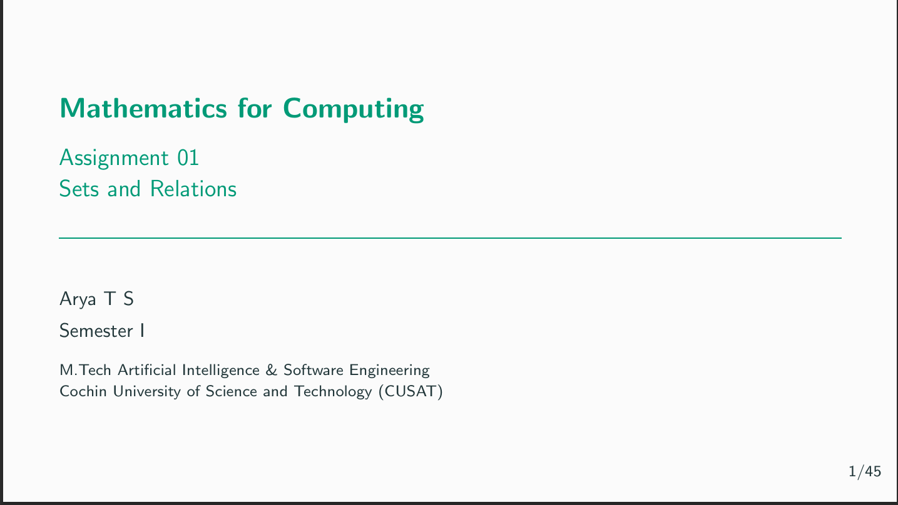

# Assignment 01 — Sets and Relations

This assignment introduces the mathematical foundations of set theory and relations, with examples connected to Artificial Intelligence and Software Engineering.

## Topics

- Sets
- Set Builder Form
- Types of Sets
- Set Operations
- Inclusion–Exclusion Principle
- Relations
- Properties of Relations
- Equivalence Relations
- Partial Orders
- Hasse Diagrams
- Maximum & Minimum
- Chains & Antichains

## Files

- presentation.tex
- presentation.pdf
- sections/

## Built With

- Overleaf
- LaTeX
- Beamer
- TikZ

## Preview

